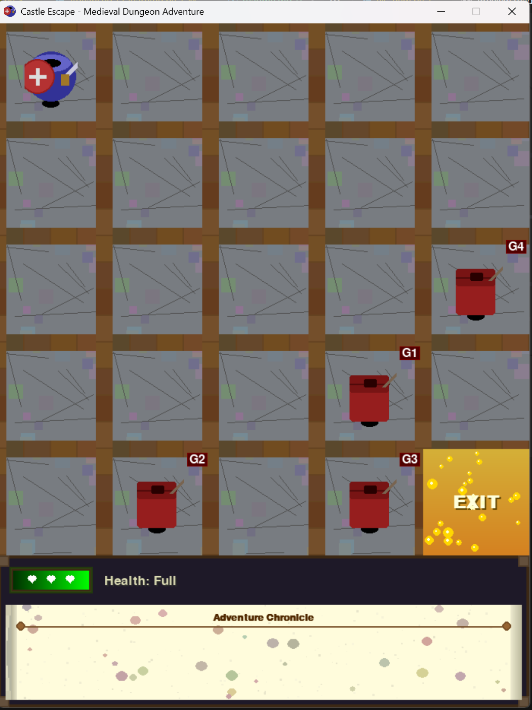

# Castle Escape

Castle Escape is a medieval-themed reinforcement learning environment where an agent must navigate through a castle to reach the exit while avoiding or confronting guards.



## Project Overview

This project implements a reinforcement learning environment for training and testing AI agents. It features:

1. A custom Gym environment implementing a grid-based dungeon escape game
2. A rich visual interface with medieval-themed graphics
3. Two Q-learning implementations (standard and advanced) for training autonomous agents
4. Pre-trained agent models that can navigate the dungeon

## Repository Structure

```
GAI_FINAL_PROJ/
├── __pycache__/
├── assets/             # Game graphics and resources
├── Advanced_Q_learning.py  # Advanced Q-learning implementation
├── advanced_Q_table.pickle # Pre-trained advanced agent model
├── mdp_gym.py          # Core game environment (CastleEscapeEnv class)
├── Q_learning.py       # Standard Q-learning implementation
├── Q_table.pickle      # Pre-trained standard agent model
├── readme.md           # Project documentation
└── vis_gym.py          # Game visualization using Pygame
```

## Game Description

### Objective

Navigate through a 5x5 castle grid from the starting position (0,0) to the exit at (4,4) while maintaining health and avoiding or defeating guards.

### Game Mechanics

- **Player**: The player starts at (0,0) with full health and must reach the exit at (4,4)
- **Guards**: Four guards patrol the castle, each with different strength and keenness attributes
- **Health**: Player has three health states: Full → Injured → Critical (defeat)
- **Actions**:
  - Movement: UP, DOWN, LEFT, RIGHT
  - FIGHT: Attempt to defeat a guard (success chance based on guard strength)
  - HIDE: Attempt to hide from a guard (success chance based on guard keenness)

### Rewards

- Reaching the exit: +10000
- Winning combat: +10
- Losing combat/defeat: -1000

## Requirements

- Python 3.7+
- pygame
- numpy
- gym
- pickle

## Installation

```bash
# Clone the repository
git clone https://github.com/rishabhkumar14/GameAIFinalProject.git
cd GameAIFinalProject

# Install dependencies
pip install pygame numpy gym
```

## Usage

### Play Manually

Run the game for manual play with keyboard controls:

```bash
python vis_gym.py
```

### Controls

- **W**: Move Up
- **S**: Move Down
- **A**: Move Left
- **D**: Move Right
- **F**: Fight guard
- **H**: Hide from guard

### Train an Agent

To train a new Q-learning agent, uncomment the training code in either implementation:

```bash
# Standard Q-learning
python Q_learning.py

# Advanced Q-learning
python Advanced_Q_learning.py
```

### Test a Pre-trained Agent

The Q-learning files include test functions that load pre-trained Q-tables and run the agent through the game:

```bash
python Q_learning.py  # Test standard agent
python Advanced_Q_learning.py  # Test advanced agent
```

## Reinforcement Learning Implementations

### Standard Q-Learning (`Q_learning.py`)

- Basic tabular Q-learning with epsilon-greedy exploration
- Learning rate that decreases with state-action visits
- Discount factor (gamma) of 0.9

### Advanced Q-Learning (`Advanced_Q_learning.py`)

- Smart exploration biases toward the goal
- Guard-specific decision making
- Cycle detection and prevention
- Position-based valid action filtering
- Reward shaping to encourage progress

## Game Environment

The `CastleEscapeEnv` class in `mdp_gym.py` implements a custom Gym environment with:

- Stochastic movement (90% intended direction, 10% random adjacent)
- Probabilistic fight and hide mechanics
- Dynamic guard movement
- Terminal states for success (reaching exit) and failure (critical health)

## Game Visualization

The `vis_gym.py` file provides a rich medieval-themed visualization with:

- Detailed stone textures for floors and walls
- Character sprites for the player (knight) and guards
- Health indicators with visual effects
- Action console displaying recent moves
- Victory and defeat screens with animations

## Credits

Developed by Rishabh Kumar for GAI Course at Northeastern University.
